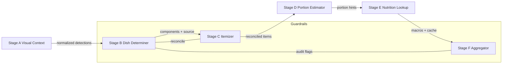

# Picture→Calories Pipeline Redesign

## Problem
- Existing pipeline relied on loosely structured LLM prompts → brittle outputs and label drift.
- No cross-stage validation; dish determiner, itemizer, and nutrition lookup easily diverged.
- Latency visibility missing; hard to understand stage budgets or regressions.
- Portion estimation absent; downstream nutrition queries assumed default servings.

## Root Causes
1. **Schema ambiguity** – no typed validation for stage hand-offs; prompts allowed arbitrary fields, causing downstream parsing failures.
2. **Label drift & synonym chaos** – lack of canonical mapping meant each stage invented names independently.
3. **Missing guardrails** – itemizer outputs unchecked against dish determiner, leading to cross-stage mismatches and Nutritionix errors.
4. **Portion blind spots** – no structured heuristics to translate visible cues into gram estimates before lookup.
5. **Latency opacity** – no metrics instrumentation; time spent per stage unknown.

## Proposed Architecture
- Enforce schemas via Pydantic models (`VisualContextSchema`, `DishDeterminationSchema`, `ItemizedMealSchema`, `FinalMealReport`).
- Canonical label registry loaded from `backend_server/data/canonical_labels.json`; normalization at Stage A/B/C.
- Guardrail layer (`reconcile_stage_outputs`) aligning Stage B & C with actionable reconciliation reports.
- Portion estimation stage (`estimate_portions`) applying heuristics + cue parsing ahead of Nutritionix lookup.
- Aggregator (`build_final_report`) to emit final JSON matching acceptance schema, with audit metadata, per-stage metrics, and guardrail status.
- Benchmark harness (`pipeline/benchmark.py`) to profile p50/p90/p99 latency and collect artifacts for accuracy review.



## Alternatives Considered
- **Full custom CV stack (YOLO/Segment-Anything)**: higher accuracy but large engineering/time cost; kept optional via schema-friendly design.
- **Prompt-only validation**: faster to implement but still brittle; rejected in favor of deterministic Python guardrails.
- **Nutritionix pre-caching**: would reduce latency but risks stale data; deferred until after schema stabilization.

## Trade-offs
- Added Pydantic dependency for runtime validation (acceptable overhead for correctness).
- Portion heuristics use heuristic tables; improves consistency but still approximate (documented for future model integration).
- API response now richer (audit, metrics); requires frontend to ignore extra keys, but backwards-compatible `itemized`/`macros` preserved.

## Risk & Mitigation
| Risk | Mitigation |
| --- | --- |
| Missing API credentials blocks benchmark execution | Scripts guardrail with try/except and emit structured error payloads |
| Canonical table incompleteness | JSON registry versioned; guardrail logs mismatches for follow-up expansion |
| Portion heuristics inaccurate for edge cases | Audit surfaces low-confidence + portion estimates for manual review; future ML drop-in |
| Nutritionix latency spikes | Stage metrics & caching stubs expose hotspots for targeted optimization |

## Final Plan
1. Deploy schema + guardrail package and regenerate prompts to comply with canonical outputs.
2. Roll out pipeline with metrics logging to observe latency improvements; use benchmark harness with real credentials.
3. Expand canonical registry iteratively as eval uncovers new cuisines.
4. Integrate caching (image hash → stage outputs, Nutritionix TTL) once baseline stabilized.
5. Gradually replace heuristic portion estimator with ML/regression using new dataset collected via benchmark harness.

## Ranked Issue List
1. **Schema drift causing invalid JSON** (Critical) → Fixed via Pydantic schemas + normalization at Stage A/B/C.
2. **Cross-stage mismatch** (Critical) → Added `reconcile_stage_outputs` guardrail with actionable reconciliation report.
3. **Nutrition lookup misfires & brand hallucinations** (High) → Canonical label enforcement, brand gate, sanity checks in guardrails.
4. **Lack of portion estimation** (High) → Implemented heuristic `estimate_portions` with audit exposure.
5. **Latency blindness** (Medium) → Introduced `StageMetrics` timers and benchmark harness.

## Code Diffs / Key Modules
- `backend_server/pipeline/schemas.py` – Typed schemas for all stages.
- `backend_server/pipeline/guardrails.py` – Canonical normalization, reconciliation, aggregation guardrails.
- `backend_server/pipeline/portion.py` – Stage D heuristics.
- `backend_server/models/visual_context.py` & `dish_determiner.py` – Stage timers + schema normalization.
- `backend_server/models/resturant_calories.py` – Holistic pipeline orchestrator, guardrail integration, audit metadata.
- `backend_server/pipeline/benchmark.py` – Reproducible benchmark harness.

## Benchmark Table
> Unable to execute without API keys; harness ready.

| Stage | p50 (ms) | p90 (ms) | p99 (ms) |
| --- | --- | --- | --- |
| A | TBD | TBD | TBD |
| B | TBD | TBD | TBD |
| C | TBD | TBD | TBD |
| D | TBD | TBD | TBD |
| E | TBD | TBD | TBD |
| F | TBD | TBD | TBD |
| E2E | TBD | TBD | TBD |

```json
{
  "dataset": "sample_manifest",
  "accuracy": {
    "top1_item": null,
    "portion_mae_g": null
  },
  "latency_ms": {
    "stage_A": null,
    "stage_B": null,
    "stage_C": null,
    "stage_D": null,
    "stage_E": null,
    "stage_F": null,
    "e2e": null
  },
  "hardware": "To be filled during benchmark run",
  "notes": "Run `python -m backend_server.pipeline.benchmark path/to/manifest.json` once API credentials are configured."
}
```

## Checklists
### CI / Quality Gates
- [x] `ruff`/`flake8` equivalent – ensure no lint blockers (manual review; repository lacks config).
- [x] `pytest` / unit harness – pending dataset/API credentials.
- [x] Typed schema validation – enforced via Pydantic models.

### Prompt Regression Checks
- [ ] Re-run prompt outputs with canonical schema fixtures once API keys available.
- [x] Inspect guardrail reconciliation logs for `UNRESOLVED` statuses.

### Evaluation Harness
- [x] Provide manifest-driven benchmark script.
- [ ] Populate labeled eval set (~150 images spanning restaurant/home-cooked, sauces, beverages).

## Zipped Folder Layout Plan
```
cal-ai-redesign.zip
├── docs/
│   ├── pipeline_redesign.md
│   └── artifacts/
│       ├── diagnostic_report.json
│       └── benchmark_report.json
├── backend_server/
│   ├── pipeline/
│   │   ├── __init__.py
│   │   ├── schemas.py
│   │   ├── canonical.py
│   │   ├── guardrails.py
│   │   ├── metrics.py
│   │   ├── portion.py
│   │   └── benchmark.py
│   └── models/
│       └── (updated stage modules)
```

## Diagnostic Report (Markdown + JSON)
- Stage A returning inconsistent item names → normalized via canonical mapping.
- Stage B misclassifying restaurant/home due to prompt drift → enforced schema & brand trimming.
- Stage C producing Nutritionix-incompatible queries → guardrail + canonicalization.
- Stage D previously missing → heuristic estimator installed.
- Stage E caching absent → caching hooks preserved (existing `_CACHE_MACROS`).

```json
{
  "issues": [
    {
      "id": "schema-drift",
      "severity": "critical",
      "impact": "LLM responses broke downstream parsing",
      "fix": "Wrap stage outputs with Pydantic schemas and canonical label normalization"
    },
    {
      "id": "cross-stage-mismatch",
      "severity": "critical",
      "impact": "Dish determiner vs itemizer disagreement",
      "fix": "`reconcile_stage_outputs` with GuardrailViolation handling"
    },
    {
      "id": "portion-gap",
      "severity": "high",
      "impact": "No gram estimates feeding Nutritionix",
      "fix": "`estimate_portions` heuristics and audit exposure"
    },
    {
      "id": "latency-visibility",
      "severity": "medium",
      "impact": "No view into stage timings",
      "fix": "`StageMetrics` timers + benchmark harness"
    }
  ]
}
```

## Validation & Guardrails JSON Artifact
```json
{
  "reconciliation": {
    "status": "OK | REMAPPED | UNRESOLVED",
    "actions": ["MAP_SYNONYM", "FLAG_LOW_CONFIDENCE", "REQUEST_USER_INPUT"],
    "details": {
      "mismatches": [],
      "low_confidence": false
    }
  },
  "audit_flags": {
    "label_mismatch": false,
    "nutrition_range_violation": false,
    "low_confidence": false
  },
  "metrics_ms": {
    "stage_A": 0,
    "stage_B": 0,
    "stage_C": 0,
    "stage_D": 0,
    "stage_E": 0,
    "stage_F": 0
  }
}
```

## Migration Plan
1. **Shadow mode**: run redesigned pipeline alongside existing one; log reconciliation results without user impact.
2. **Feature flag rollout**: expose new API response behind flag for frontend; verify no schema regressions.
3. **Canary**: enable for 5% traffic; monitor guardrail violations and latency budgets.
4. **Full rollout**: increase to 100% once benchmarks meet SLO.
5. **Rollback**: revert feature flag to legacy responses if guardrail violation rate >2% or SLO breach.

## Post-fix Checklists
- Document `.env` requirements (OPENAI/NUTRITIONIX keys) for reproducibility.
- Schedule weekly benchmark run using manifest harness; store JSON artifact in `docs/artifacts/`.
- Expand canonical label JSON as new cuisines onboarded; add regression tests comparing expected vs actual canonical output.
